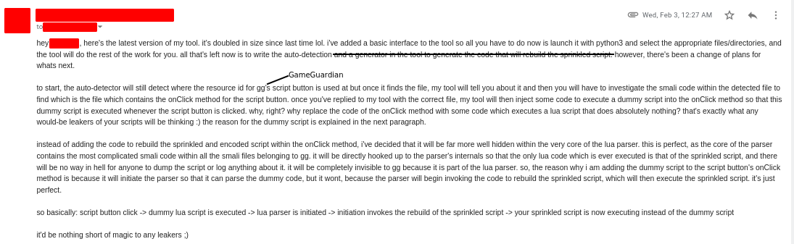

# BCTool
An unfinished tool that will sprinkle a file's data across GameGuardian's smali code and rebuild it at runtime. Contains a full fledged smali parser.

This is an old project of mine i was working on for a customer during early 2020. The goal of it was to protect their lua scripts made for GameGuardian that people would leak to unpaid users. It is a very clever tool with tons of potential and i might work on it again some day.

It works by taking the input file, compressing it with gzip, and sprinkles a set of bytes from the file into a randomly chosen class. That class would then feature a new method that follows it's proguard name ordering and returns a set of bytes from the original buffer. The class would also feature a new annotation that would let the rebuilder know what method contains the data, the length of that data, the position of the data in the original buffer, and if the data has been gzipped. This would repeat over and over until the original buffer has been exhausted, essentially 'sprinkling' the data across the smali code in an incospicuous manner.

# Usage
```
usage: python3 bctool.py [-h] [--script PATH] [--gg-src DIR] [-p PKG]
                         [--no-gui]

Sprinkles any script you give this tool across GG's code.

optional arguments:
  -h, --help         Show this help message and exit
  --script PATH      Path to the script you wish to sprinkle.
  --gg-src DIR       Path to GG's src directory. Attempts to use the
                     current directory if this is left blank.
  -p PKG, --pkg PKG  Set this flag to make the tool sprinkle your
                     script across a specific java
                     package(directory). Defaults to luaj.
  --no-gui           Disables the creation of a GUI, but requires you
                     to atleast supply the --script option.
```


